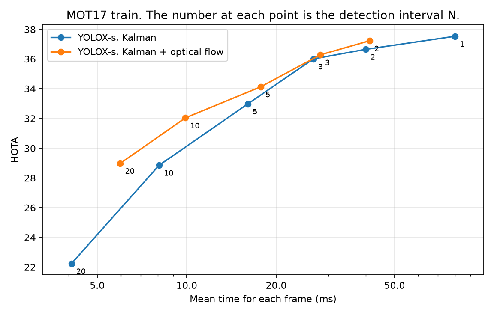
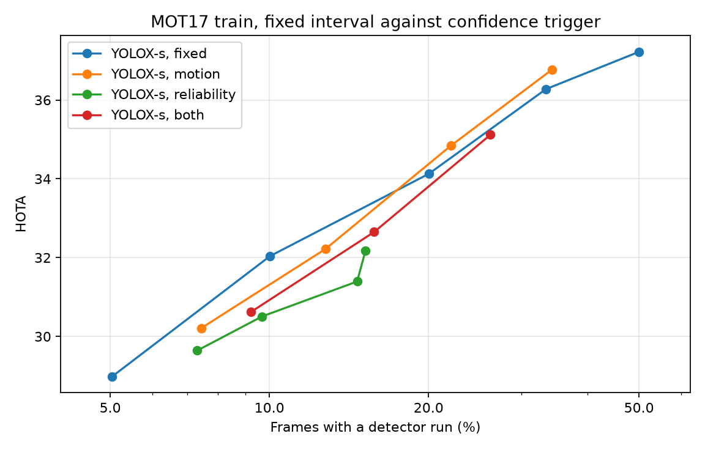
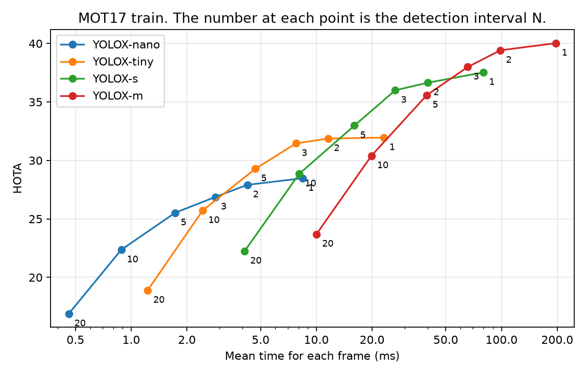
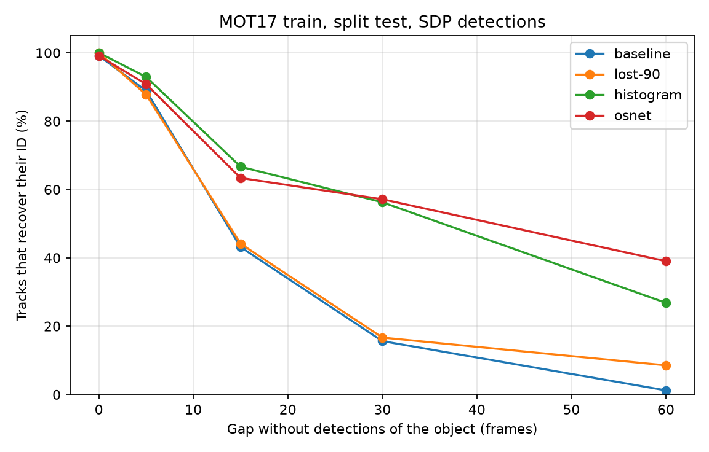

# leantrack

A multi-object tracking runtime that uses the detector as a limited resource.

Most tracking libraries run the detector on every frame. `leantrack` will decide, frame by
frame, between a detector run and a low-cost track propagation. It will do this against a
latency budget, and it will report the accuracy cost of each decision.

## Status

Phases 1 and 2 of 6 are complete, and Phase 3 is in progress. The scheduler has a
fixed-interval policy and a confidence trigger, with optical flow between detector runs.
Lost tracks can recover by appearance, also in the live pipeline. The learned failure
predictor does not exist yet.

| Phase | Content | Status |
|---|---|---|
| 1 | Tracker core, MOT input and output, evaluation, baseline | Complete |
| 2 | Detection scheduler, track propagation between detections | Complete |
| 3 | Failure detection, recovery, re-identification | In progress |
| 4 | Budget controller, ONNX detector, benchmark report | Not started |
| 5 | Stream service, metrics endpoint, container | Not started |
| 6 | Demo assets, decision records | Not started |

## What exists

- A constant-velocity Kalman filter on `(cx, cy, w, h)` with noise that scales with box size.
- Optimal assignment with a cost gate (`scipy.optimize.linear_sum_assignment`).
- Two-pass IoU association in the style of ByteTrack.
- An explicit track lifecycle: `tentative -> confirmed -> lost -> removed`. An illegal
  transition raises an error.
- A reader and a writer for the MOTChallenge format.
- A synthetic scene generator with occlusion intervals, for deterministic tests.
- An evaluation script that uses TrackEval and compares against BoxMOT ByteTrack.
- A fixed-interval schedule policy. Between detector runs, the tracker reports its
  Kalman prediction.
- Two detector backends behind one `Detector` protocol (see "Detector backends").

## Baseline results

MOT17 train, 7 sequences, public detections from the dataset. Each tracker gets the same
detection file, so the scores compare association only. Both trackers use their default
parameters. No parameter was tuned on this data.

| Detections | Tracker | HOTA | AssA | DetA | MOTA | IDF1 | IDSW | Step p50 (ms) | Step p99 (ms) |
|---|---|---:|---:|---:|---:|---:|---:|---:|---:|
| FRCNN | BoxMOT ByteTrack 25.0.0 | 47.32 | 50.71 | 44.37 | 49.43 | 55.17 | 657 | 1.15 | 2.82 |
| FRCNN | leantrack | 47.11 | 49.88 | 44.72 | 49.39 | 54.22 | 609 | 0.42 | 1.22 |
| SDP | BoxMOT ByteTrack 25.0.0 | 54.05 | 53.24 | 55.08 | 64.10 | 64.30 | 920 | 1.25 | 3.32 |
| SDP | leantrack | 53.94 | 53.51 | 54.54 | 63.89 | 64.28 | 846 | 0.48 | 1.50 |

The step time is the tracker update only, on an Apple M3 Pro, one run. It does not include
detection. Do not compare these scores with published MOT17 scores, because published
scores use the test set and stronger private detectors.

## Detection interval experiment

The detector runs on each N-th frame. On the other frames, the tracker reports its
Kalman prediction. MOT17 train, 7 sequences, YOLOX-s (COCO weights, 640 x 640) through
ONNX Runtime on the CPU of an Apple M3 Pro, one run.

| N | Detector runs (%) | Mean (ms/frame) | p99 (ms/frame) | HOTA | AssA | DetA | MOTA | IDF1 | IDSW |
|---:|---:|---:|---:|---:|---:|---:|---:|---:|---:|
| 1 | 100.00 | 79.83 | 109.43 | 37.53 | 48.14 | 29.41 | 33.12 | 44.22 | 245 |
| 2 | 50.02 | 39.97 | 97.46 | 36.64 | 47.78 | 28.27 | 31.69 | 42.99 | 301 |
| 3 | 33.33 | 26.66 | 92.16 | 36.00 | 48.14 | 27.09 | 30.05 | 41.90 | 297 |
| 5 | 20.02 | 16.06 | 86.49 | 32.98 | 44.64 | 24.57 | 26.92 | 37.46 | 326 |
| 10 | 10.03 | 8.08 | 81.48 | 28.85 | 42.03 | 20.02 | 20.18 | 31.39 | 324 |
| 20 | 5.04 | 4.10 | 79.49 | 22.24 | 37.13 | 13.57 | 10.62 | 22.22 | 234 |

What the data shows:

- At N = 3, the mean frame time decreases by 67% and HOTA decreases by 1.53 points.
- From N = 5, the loss increases quickly. Most of the loss is in DetA, the detection part.
- The p99 time stays near 80 ms at each N. A frame with a detector run costs the same as
  before, so a fixed interval improves the mean time and not the worst frame time.
- The absolute scores are low. The model has COCO weights and no MOT17 training. The
  public FRCNN detections give 47.11 HOTA with the same tracker.

The time is the stored detector latency plus the tracker time. It does not include the
image decode.

### Optical flow between detector runs

Between detector runs, sparse Lucas-Kanade flow measures the motion of each box, and the
Kalman filter uses that as a measurement. A forward-backward check rejects unreliable
points. Same model and data as above.

| N | Mean (ms/frame), Kalman | Mean (ms/frame), flow | HOTA, Kalman | HOTA, flow | IDSW, Kalman | IDSW, flow |
|---:|---:|---:|---:|---:|---:|---:|
| 2 | 39.97 | 41.21 | 36.64 | 37.22 | 301 | 206 |
| 3 | 26.66 | 28.14 | 36.00 | 36.28 | 297 | 199 |
| 5 | 16.06 | 17.74 | 32.98 | 34.13 | 326 | 189 |
| 10 | 8.08 | 9.89 | 28.85 | 32.04 | 324 | 164 |
| 20 | 4.10 | 5.98 | 22.24 | 28.98 | 234 | 119 |



- The flow adds 1.2 to 1.9 ms to the mean frame time.
- The gain increases with N: 0.28 HOTA at N = 3, 3.19 at N = 10, and 6.74 at N = 20.
- The flow decreases the ID switches by 32% to 49%.
- With the flow, N = 10 (9.89 ms, 32.04 HOTA) is near N = 5 without it (16.06 ms, 32.98 HOTA).
- Known limit: when an object is mostly hidden, the points follow the object in front.

### Fixed interval against confidence trigger

The confidence trigger runs the detector when the tracks become uncertain. It has two
signals for each track: the reliability of the optical flow, and the motion since the
last detection in box sizes. It also has a maximum interval of 20 frames and a minimum
interval of 2 frames.

The two signals do predict a bad box. On four sequences at N = 10, a box with flow
reliability below 0.25 had an IoU below 0.5 in 77.8% of cases, against 15.6% for
reliability above 0.9. For motion above 0.8 box sizes the rate was 57.2%, against 12.4%
for motion below 0.05.

The comparison is HOTA at an equal share of frames with a detector run. The "fixed, same
share" column is a linear interpolation between the two nearest fixed intervals.

| Trigger | Threshold | Detector runs (%) | HOTA | HOTA of fixed, same share | Difference |
|---|---:|---:|---:|---:|---:|
| Motion | 0.10 | 34.24 | 36.77 | 36.33 | +0.44 |
| Motion | 0.20 | 22.03 | 34.84 | 34.45 | +0.39 |
| Motion | 0.40 | 12.77 | 32.22 | 32.61 | -0.39 |
| Motion | 0.80 | 7.43 | 30.21 | 30.45 | -0.24 |
| Reliability | 0.05 | 15.20 | 32.18 | 33.12 | -0.94 |
| Reliability | 0.10 | 14.65 | 31.39 | 33.01 | -1.62 |
| Reliability | 0.20 | 9.69 | 30.51 | 31.83 | -1.32 |
| Reliability | 0.40 | 7.30 | 29.64 | 30.37 | -0.73 |



**Result: the trigger is not better than a fixed interval on this data.** The motion
trigger is within 0.5 HOTA of the fixed interval in the two directions. The reliability
trigger is 0.7 to 1.6 points lower. A fixed interval is thus the correct default here.

Possible causes, not tested:

- Most of the loss at long intervals is in DetA. Objects that the tracker does not know
  cause a part of that loss, and no track signal can show a new object.
- Low flow reliability frequently means occlusion. The detector cannot see a hidden
  object, so a detector run at that time does not help.
- The MOT17 scenes are crowded. With 20 or more tracks, some track is almost always above
  a threshold, so the trigger behaves like an irregular fixed interval.

The fixed interval points of this experiment are identical to the table above, which is
a check of the pipeline. One design point came from this experiment: on a frame with a
detector run, the detection must replace the flow measurement. When the filter used the
two, HOTA was 1.00 lower at N = 10 and 1.70 lower at N = 20.

### Model size against interval

Kalman prediction only. Each row is one point near a frame time budget.

| Configuration | Mean (ms/frame) | HOTA |
|---|---:|---:|
| YOLOX-s, N = 1 | 79.83 | 37.53 |
| YOLOX-m, N = 3 | 65.69 | 37.99 |
| YOLOX-s, N = 2 | 39.97 | 36.64 |
| YOLOX-m, N = 5 | 39.48 | 35.58 |
| YOLOX-tiny, N = 1 | 23.09 | 31.95 |
| YOLOX-s, N = 5 | 16.06 | 32.98 |
| YOLOX-nano, N = 1 | 8.42 | 28.47 |
| YOLOX-s, N = 10 | 8.08 | 28.85 |



A larger model with a longer interval can be better than a smaller model on each frame.
YOLOX-m at N = 3 is faster than YOLOX-s at N = 1 and has a higher score. Thus the model
size and the interval must be selected together.

## Recovery after occlusion

The experiment removes the detections of one ground-truth object for D frames. A track
"recovers" if the track that followed the object before the gap follows it again in the
30 frames after the gap. The detector runs on each frame, and each event has its own
tracker run. The detections are the public SDP detections of MOT17.

A lost track can recover in two ways. The IoU match works while the predicted box
overlaps the object. The appearance match compares a stored vector of the track with the
vector of an unmatched detection. A position gate from the Kalman covariance limits the
candidates. The appearance also blocks the IoU match of a lost track with a detection
that looks different.

The thresholds were selected on three sequences (02, 04, 09). The table shows the four
other sequences (05, 10, 11, 13), which have moving cameras.

| Gap D (frames) | Events | Default | Lost lifetime 90 | Histogram | OSNet x0.25 |
|---:|---:|---:|---:|---:|---:|
| 0 | 112 | 99.11 | 100.00 | 100.00 | 99.10 |
| 5 | 99 | 88.89 | 87.76 | 92.93 | 90.82 |
| 15 | 102 | 43.14 | 44.12 | 66.67 | 63.37 |
| 30 | 96 | 15.62 | 16.67 | 56.25 | 57.14 |
| 60 | 82 | 1.22 | 8.54 | 26.83 | 39.02 |

The values are the percentage of tracks that recover. The event count changes by 1 to 3
between variants, because an event counts only if the object had a track before the gap.



- Appearance increases the recovery at D = 30 from 15.62% to about 57%.
- A longer lifetime without appearance gives almost no gain. The predicted box drifts
  away, so the IoU match fails.
- The histogram is equal to OSNet up to D = 30. It costs 0.07 ms for each box, against
  about 1.6 ms for OSNet on this CPU. OSNet is better only at D = 60.
- The rate at which the stored vector updates had a large effect. On the tune split at
  D = 60, a momentum of 0.9 gave 57.53% and a momentum of 0.5 gave 68.49%.

**The MOT17 scores do not improve.** On the full MOT17 train set with SDP detections,
recovery by appearance changes HOTA by less than 0.1:

| Tracker | HOTA | IDF1 | IDSW |
|---|---:|---:|---:|
| leantrack, default | 53.94 | 64.28 | 846 |
| leantrack, lost lifetime 90 | 53.30 | 63.11 | 938 |
| leantrack, OSNet, lost lifetime 30 | 53.88 | 63.71 | 791 |
| leantrack, OSNet, lost lifetime 60 | 53.99 | 63.97 | 846 |
| leantrack, OSNet, lost lifetime 90 | 53.88 | 63.63 | 876 |

A longer lifetime without appearance makes the scores worse. Appearance removes that
loss but adds no gain. Thus the synthetic test shows a capability that this benchmark
does not reward. The cause is not tested.

### Recovery in the live pipeline

Here the embedder runs on the real pixels in the pipeline, and its time is in the frame
time. MOT17 train, 7 sequences, YOLOX-s detections, optical flow between detector runs,
default lost lifetime of 30 frames.

| N | Appearance | Embedder time for each detector run (ms) | Mean (ms/frame) | HOTA | IDF1 | IDSW |
|---:|---|---:|---:|---:|---:|---:|
| 1 | None | 0.00 | 81.98 | 37.53 | 44.22 | 245 |
| 1 | Histogram | 0.11 | 82.27 | 38.37 | 45.19 | 230 |
| 1 | OSNet x0.25 | 4.45 | 87.28 | 38.52 | 45.58 | 219 |
| 5 | None | 0.00 | 18.12 | 34.13 | 39.01 | 189 |
| 5 | Histogram | 0.13 | 18.45 | 34.36 | 39.79 | 195 |
| 5 | OSNet x0.25 | 3.32 | 19.15 | 34.62 | 40.27 | 186 |

- With the YOLOX-s detections, appearance does improve the scores: +0.84 HOTA for the
  histogram and +0.99 for OSNet at N = 1. With the stronger SDP detections above, it did
  not. A possible cause, not tested: a weaker detector misses objects more frequently,
  so more tracks become lost and can recover.
- The histogram gives most of the gain of OSNet for about 3% of its time.
- OSNet adds 5.30 ms to the mean frame at N = 1, which is 6.5%.
- The tracker requests few vectors. OSNet takes about 1.6 ms for each box, so 4.45 ms is
  about 3 boxes for each detector run.

Limits of this experiment:

- The gap removes detections only. The pixels do not change, so the object looks the
  same after the gap as before it.
- In the occlusion experiment and in the SDP table, the appearance vectors come from
  stored files, so those step times do not include the embedder.
- The tune split has 73 to 89 events and the test split has 82 to 112. One event is about
  1 percentage point.

## Detector backends

| Backend | Install | License of the backend |
|---|---|---|
| YOLOX through ONNX Runtime (default) | included | Apache-2.0 |
| Ultralytics YOLO (optional) | `pip install -e ".[ultralytics]"` | AGPL-3.0 |

The core of `leantrack` does not import Ultralytics, and the MIT license applies to the
code in this repository. If you install the optional backend, the AGPL-3.0 terms of
Ultralytics apply to the combination that you make.

The YOLOX backend uses the ONNX files of the
[YOLOX 0.1.1 release](https://github.com/Megvii-BaseDetection/YOLOX/releases/tag/0.1.1rc0).
Put them in `models/`.

## Install

```sh
python3.12 -m venv .venv
.venv/bin/pip install -e ".[dev]"
.venv/bin/pytest
```

## Use

Track a video file or an image directory with a YOLOX model:

```sh
.venv/bin/leantrack track video.mp4 --out tracks.txt --model models/yolox_s.onnx \
    --interval 3 --flow --reid histogram
```

- `--interval N` runs the detector on each N-th frame.
- `--flow` corrects the tracks with optical flow between detector runs.
- `--reid` is `none`, `histogram`, or the path of a ReID model in ONNX format.

The output has the MOTChallenge format: `frame, id, left, top, width, height, score`.

Track one MOTChallenge sequence from its detection file, without a model:

```sh
.venv/bin/leantrack track data/MOT17/train/MOT17-02-FRCNN --out runs/MOT17-02.txt
```

Reproduce the table (this needs MOT17 in `data/MOT17`):

```sh
.venv/bin/pip install -e ".[bench]"
.venv/bin/python -m bench.mot17 --detector FRCNN
.venv/bin/python -m bench.mot17 --detector SDP --out runs/mot17-sdp
```

Run the interval experiment (this needs `models/yolox_s.onnx`):

```sh
.venv/bin/python bench/cache_detections.py models/yolox_s.onnx
.venv/bin/python -m bench.interval yolox_s
.venv/bin/python -m bench.interval yolox_s --flow
.venv/bin/python -m bench.trigger yolox_s --jobs 4
```

Run the occlusion experiment (the OSNet variant needs an ONNX export of OSNet x0.25):

```sh
.venv/bin/python -m bench.cache_embeddings histogram
.venv/bin/python -m bench.cache_embeddings osnet --model models/osnet_x0_25_msmt17.onnx
.venv/bin/python -m bench.occlusion --split test --jobs 6
```

## Prior work

The association follows ByteTrack (Zhang et al., 2022). Detection at intervals with
tracking between detections is not a new idea. See Confidence-Triggered Detection
(arXiv 1902.00615) and SDOF-Tracker (arXiv 2106.14259). This project adds a tested
implementation and published measurements of the trade-off.

## License

MIT
