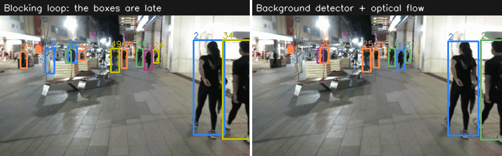
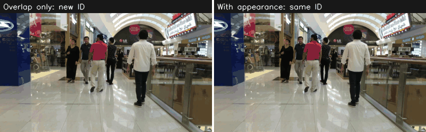

# leantrack

[](https://github.com/yash-bitla/leantrack/actions/workflows/ci.yml)
[](LICENSE)

A real-time multi-object tracking (MOT) runtime that uses the detector as a limited
resource.

Most tracking libraries run the detector on every frame. On a live stream that is
frequently not possible: a detector that takes 80 ms cannot keep up with a camera that
gives a frame each 33 ms. `leantrack` decides when the detector runs, keeps each track
correct between detector runs, and measures the accuracy cost of each decision.

- **Tracks arrive about 20 times sooner on a live stream.** With the detector in a
  background thread and optical flow between its results, the mean output latency is
  5.1 ms in place of 101.4 ms, and HOTA is 1.59 points higher.
- **It is built from standard parts.** A ByteTrack-style tracker with a Kalman filter,
  YOLOX through ONNX Runtime, sparse optical flow, and recovery of lost tracks by
  appearance (a color histogram or a ReID network).
- **Each trade-off is measured on MOT17,** and the results that did not work are in the
  repository too.

The story behind these results is in the blog post [My object detector was too slow for live video. So I stopped waiting for it.](https://yashbitla.com/blog/stopped-waiting-for-the-detector/)



*Left: the loop waits for the detector, so the boxes are behind the people. Right: the
detector runs in the background and optical flow moves the boxes. The green point marks
a frame that uses a new detector result. Footage: MOT17-10.*

## Results in short

MOT17 train, YOLOX-s on the CPU of an Apple M3 Pro. [docs/results.md](docs/results.md)
has each table in full, with its limits.

| Configuration on a live stream | Output latency, mean | HOTA |
|---|---:|---:|
| Blocking loop, detector on each frame it can process | 101.4 ms | 32.90 |
| Detector in the background + optical flow | 5.1 ms | 34.49 |
| INT8 model, background with a frame budget of 33 ms | 18.7 ms | 36.37 |
| Reference: detector on each frame, time does not count | not real time | 37.53 |

- With the detector on each 3rd frame, the mean frame time decreases by 65% and HOTA
  decreases by 1.25 points.
- After a gap of 30 frames without detections, 57% of tracks get their ID again with
  appearance, against 16% without it.
- The tracker core gives the same scores as BoxMOT ByteTrack on the same detections
  (47.11 against 47.32 HOTA).

## How it works

```text
Video file / camera / stream
        |
        v
Frame loop  (one thread, never waits for a client)
        |
        +--> Optical flow --------> Kalman filter: move each track to this frame
        |
        +--> Schedule: does this frame get a detector result?
        |        |
        |        +-- fixed interval, confidence trigger, or
        |            background thread with a frame time budget
        |
        v
Association  (two passes by overlap, in the style of ByteTrack)
        |
        +--> Recovery of lost tracks by appearance (histogram or ReID network)
        |
        v
Track lifecycle:  tentative -> confirmed <-> lost -> removed
        |
        +--> Result file (MOTChallenge format)
        +--> WebSocket events, MJPEG video, Prometheus metrics
```

| Part | Code |
|---|---|
| Kalman filter, optical flow | `src/leantrack/propagate/` |
| Assignment | `src/leantrack/associate/` |
| Tracker and track lifecycle | `src/leantrack/tracks/` |
| Schedule policies | `src/leantrack/schedule/` |
| Background detector, frame budget | `src/leantrack/realtime.py` |
| Appearance embedders | `src/leantrack/reid/` |
| Failure predictor | `src/leantrack/confidence/` |
| Detector backends | `src/leantrack/detect/` |
| Stream service | `src/leantrack/serve/` |
| Experiments | `bench/` |

## What the experiments found

| Question | Answer | Evidence |
|---|---|---|
| How much accuracy does a skipped detector run cost? | N = 3 with optical flow: 28.1 ms in place of 79.8 ms, and 36.28 HOTA in place of 37.53 | [Interval](docs/results.md#detection-interval-experiment) |
| Does optical flow between detector runs help? | Yes. +3.19 HOTA at N = 10 for about 2 ms | [Flow](docs/results.md#optical-flow-between-detector-runs) |
| Is a larger model with a longer interval better than a smaller model on each frame? | Sometimes. YOLOX-m at N = 3 is better than YOLOX-s at N = 1 | [Model size](docs/results.md#model-size-against-interval) |
| Does a slow detector belong in a background thread? | Yes. Latency 101 ms to 5 ms, and +1.59 HOTA | [Live stream](docs/results.md#live-stream-with-a-slow-detector) |
| Must a late detector result be corrected? | Yes. Without the correction, HOTA is 2.94 lower | [Live stream](docs/results.md#live-stream-with-a-slow-detector) |
| Does INT8 quantization help? | Yes. 2.8 times faster for -1.00 HOTA offline, and +1.95 HOTA on a live stream | [Quantized model](docs/results.md#quantized-model) |
| Can a lost track recover by appearance? | Yes. 16% to 57% at a gap of 30 frames | [Occlusion](docs/results.md#recovery-after-occlusion) |
| Is a ReID network necessary for that? | Not for short gaps. A color histogram is equal up to 30 frames, at about 3% of the time | [Occlusion](docs/results.md#recovery-after-occlusion) |



*The detections of one person are removed for 30 frames. Left: the tracker matches by
overlap only, and the person gets a new ID. Right: the tracker also compares the
appearance, and the person keeps the ID. Footage: MOT17-11.*

### What did not work

These results are in the repository because they changed the design.

- **A confidence trigger is not better than a fixed interval.** Two track signals do
  predict a bad box. But a detector run at that time does not correct the box, and the
  trigger is within 0.5 HOTA of a fixed interval or below it.
  [Details](docs/results.md#fixed-interval-against-confidence-trigger)
- **A learned failure predictor is weak.** A logistic regression on 8 features has an
  AUC of 0.73, against 0.71 for one feature alone. Its probabilities are wrong on a new
  scene type, and a filter on them makes HOTA lower.
  [Details](docs/results.md#failure-predictor)
- **Recovery by appearance does not improve the MOT17 score with strong detections.**
  It changes HOTA by less than 0.1 with the SDP detections. With the weaker YOLOX-s
  detections it adds 0.84 to 0.99.
  [Details](docs/results.md#recovery-in-the-live-pipeline)
- **A background detector is worse for a fast detector.** If the detector fits in the
  frame period, a blocking loop is 0.60 HOTA better. The frame time budget corrects this.
  [Details](docs/results.md#frame-time-budget)

## Install

```sh
python3.12 -m venv .venv
.venv/bin/pip install -e ".[dev,serve]"
.venv/bin/pytest
```

Get a YOLOX model in ONNX format from the
[YOLOX 0.1.1 release](https://github.com/Megvii-BaseDetection/YOLOX/releases/tag/0.1.1rc0)
and put it in `models/`.

## Use

Track a video file and write a result file:

```sh
.venv/bin/leantrack track video.mp4 --out tracks.txt --model models/yolox_s.onnx \
    --interval 3 --flow --reid histogram
```

Run on a live source with the detector in the background:

```sh
.venv/bin/leantrack track rtsp://camera/stream --out tracks.txt \
    --model models/yolox_s.onnx --background --frame-budget-ms 33
```

| Option | Effect |
|---|---|
| `--interval N` | Run the detector on each N-th frame |
| `--flow` | Correct the tracks with optical flow between detector runs |
| `--background` | Run the detector in a background thread. Optical flow is always on |
| `--frame-budget-ms` | With `--background`: wait for the detector if the result fits in this time |
| `--reid` | `none`, `histogram`, or the path of a ReID model in ONNX format |

The result file has the MOTChallenge format: `frame, id, left, top, width, height, score`.

### Stream service

```sh
.venv/bin/leantrack serve video.mp4 --model models/yolox_s.onnx --background --loop
```

| Path | Content |
|---|---|
| `/` | A page with the video and the statistics |
| `/video` | The video with the tracks, as an MJPEG stream |
| `/ws` | A WebSocket with one JSON event for each frame |
| `/stats` | Frame count, track count, frame rate, and latency as JSON |
| `/metrics` | Metrics in the Prometheus format |
| `/health` | The state of the pipeline. The status is 503 after a failure |

One event of `/ws`:

```json
{
  "frame": 132,
  "detected": true,
  "detection_age": 1,
  "latency_ms": 5.003,
  "objects": [{"id": 1, "box": [451.8, 403.9, 553.0, 727.1], "score": 0.893, "class": 0}]
}
```

`compose.yaml` starts the service with Prometheus and a Grafana dashboard:

```sh
SOURCE=/data/video.mp4 MODEL=/models/yolox_s.onnx docker compose up --build
```

The service handles one source and has no authentication. Do not put it on a public
network.

## Design decisions

Each record is short: the context, the decision, and the measurement behind it.

1. [Write the tracker core, and use BoxMOT as the reference](docs/decisions/0001-own-tracker-core.md)
2. [Keep the AGPL detector backend optional](docs/decisions/0002-optional-agpl-backend.md)
3. [Use a fixed interval as the default schedule](docs/decisions/0003-fixed-interval-default.md)
4. [Let a detection replace the flow measurement](docs/decisions/0004-detection-replaces-flow.md)
5. [Request appearance vectors only when necessary](docs/decisions/0005-lazy-appearance.md)
6. [Run a slow detector in the background and correct its late result](docs/decisions/0006-background-detector.md)
7. [Use a simulated clock for the live stream experiments](docs/decisions/0007-simulated-clock.md)
8. [Do not ship weights that come from MOT17](docs/decisions/0008-no-mot17-weights.md)

## Limits

- Each number comes from one run on one machine, an Apple M3 Pro CPU. No experiment
  used a GPU or a small device.
- The detector models have COCO weights and no MOT17 training, so the absolute scores
  are low. The comparisons between configurations are the result.
- A change of the detector timing alone moves HOTA by about 0.7 on a live stream. A
  smaller difference between two live configurations is not reliable.
- The live stream experiments use a simulated clock. One manual run of the stream
  service used a real thread and held 30 frames for each second.
- The thresholds for appearance come from three MOT17 sequences. A different scene type
  possibly needs different values.
- No test uses a camera or a network stream.

## Detector backends

| Backend | Install | License of the backend |
|---|---|---|
| YOLOX through ONNX Runtime (default) | included | Apache-2.0 |
| Ultralytics YOLO (optional) | `pip install -e ".[ultralytics]"` | AGPL-3.0 |

The core of `leantrack` does not import Ultralytics, and the MIT license applies to the
code in this repository. If you install the optional backend, the AGPL-3.0 terms of
Ultralytics apply to the combination that you make.

## Prior work

- The association follows ByteTrack (Zhang et al., 2022).
- The optical flow step follows MedianFlow (Kalal et al., 2010).
- Detection at intervals with tracking between detections is not a new idea. See
  Confidence-Triggered Detection (arXiv 1902.00615) and SDOF-Tracker (arXiv 2106.14259).

This project adds a tested implementation, the measurements of each trade, and the
results that did not work.

## Data and licenses

- The code has the MIT license.
- The demo GIFs show frames of the [MOT17](https://motchallenge.net/data/MOT17/) dataset
  (Milan et al., 2016), which has the CC BY-NC-SA 3.0 license. They are for
  non-commercial use only.
- The repository contains no model weights. The frames in the two GIFs are its only
  dataset content.
